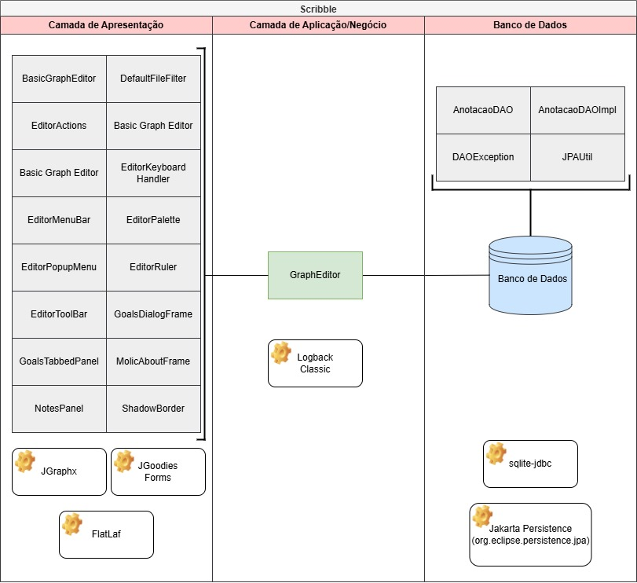

# Scribble

|  | Scribble é um sistema desktop desenvolvido em Java, cujo objetivo é facilitar a criação, edição e salvamento de diagramas Molic (Modelo de Interação de Linhas de Conversação). Ele foi projetado para ser uma ferramenta prática e intuitiva para diagramar e documentar interações em projetos de design conversacional. |
|:-------------------------------------------------------:|:---------------------------------------------------------------------------------------------------------------------------------------------------------------------------------------------------------------------------------------------------------------------------------------------------------------------------|

---

# Clientes 👥

Nossa principal cliente é a professora Ingrid Monteiro, do campus de Quixadá da UFC. Além dela, as partes que se
beneficiarão do sistema incluem alunos da disciplina de Interação Humano-Computador (IHC), pesquisadores e designers de
interação.
Durante a fase de elicitação de requisitos, foram conduzidas entrevistas semiestruturadas com nossa principal cliente.
Durante o processo de desenvolvimento, foram realizadas reuniões com o intuito de receber feedbacks e sugestões de
melhoria.

---

# Requisitos e Histórias de Usuário 📄

Este documento tem como objetivo definir e detalhar os requisitos funcionais e não funcionais do sistema Scribble. Ele
serve como uma referência centralizada para descrever as funcionalidades, restrições e comportamentos esperados,
garantindo que o sistema atenda às necessidades dos usuários e cumpra as especificações técnicas. Como também, as
histórias de usuários descritas neste documento têm como objetivo capturar as necessidades e expectativas dos usuários
finais em relação ao sistema Scribble. Essas histórias orientam o desenvolvimento de funcionalidades de maneira
incremental e centrada no usuário, ajudando a garantir que o produto final atenda aos requisitos práticos e facilite a
experiência do usuário.

Link: [Requisitos e Histórias de Usuário](./Documentação/Requisitos%20Funcionais%20e%20Não-Funcionais%20e%20Histórias%20de%20Usuário.pdf)

---

# Modelagem 📐

A modelagem de classes define a estrutura estática, detalhando entidades como diagramas e elementos gráficos, suas
propriedades e interações. Já a modelagem de atividades representa o fluxo dinâmico do sistema, descrevendo as etapas e
processos envolvidos na criação, edição e salvamento de diagramas Molic. Juntas, essas modelagens oferecem uma visão
completa dos processos do Scribble, garantindo um planejamento e implementação eficazes.

Link: [Modelagem](Documentação/Modelagem%20&%20Arquitetura.pdf)

---

# Arquitetura ⚙

---

# Testes 🔎

No projeto Scribble, os testes unitários validaram o funcionamento de componentes isolados, enquanto os testes
sistêmicos manuais avaliaram o comportamento do sistema como um todo, garantindo que os fluxos de criação, edição e
salvamento de diagramas funcionassem corretamente.

## Testes Unitários

## Testes Sistémicos

Link: [Testes Manuais](https://docs.google.com/spreadsheets/d/19H1wCPnC2xXhk8pEj9W9kB_1EBQ89W3a/edit?gid=173414780#gid=173414780)
