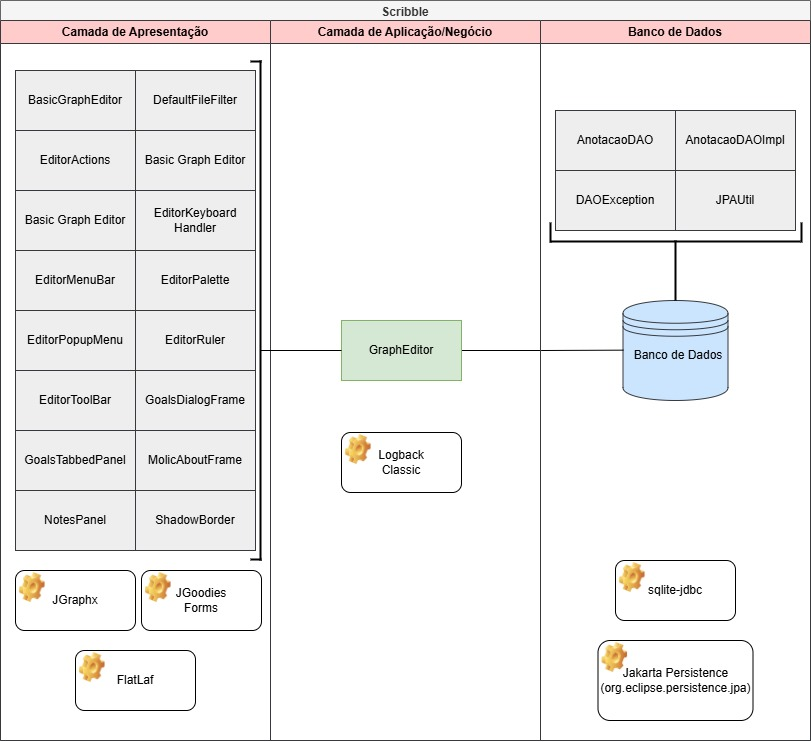

# Scribble

|  | Scribble é um sistema desktop desenvolvido em Java, cujo objetivo é facilitar a criação, edição e salvamento de diagramas Molic (Modeling Language for Interaction as Conversation). Ele foi projetado para ser uma ferramenta prática e intuitiva para diagramar e documentar interações em projetos de design conversacional. |
|:--:|:--|

# Arquitetura ⚙

